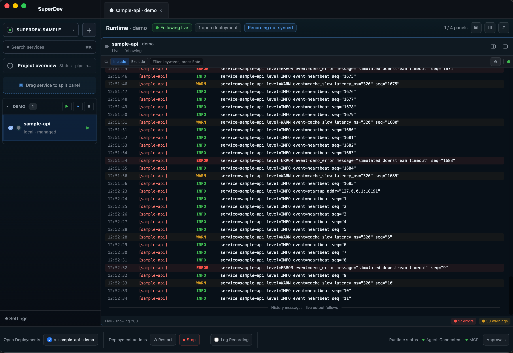
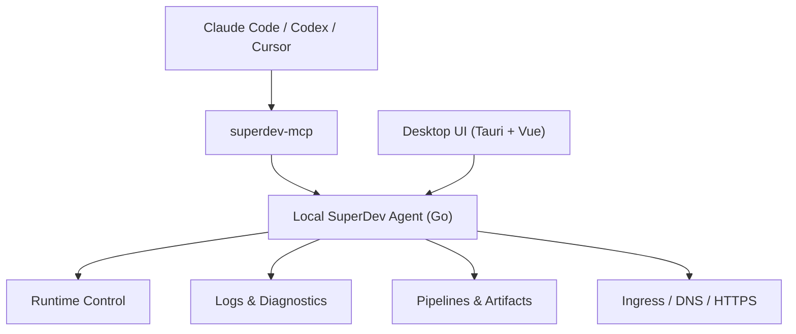

<p align="center">
  
</p>

# SuperDev

<p align="center">
  <strong>AI-native 的运行态协作层。</strong><br />
  让开发者与 AI 共享服务、日志、部署与审批上下文，在同一个真实环境里持续协作。
</p>

<p align="center">
  
  
  
  
  
  
</p>

| 中文界面 | English UI |
| --- | --- |
|  |  |

> 截图路径已固定；发布前请把干净的中英文界面截图放到 `docs/assets/readme/`。

## 为什么是 SuperDev

AI 编程工具已经能读代码、改代码、跑命令，但代码协作只解决了“AI 知道仓库里有什么”。真正开发时，最难的是“AI 不知道你此刻正在运行什么”：哪些服务已经启动，哪个端口正在被使用，哪段日志对应当前功能，哪次 pipeline 刚刚发布，哪个远端 deployment 正在出错。

如果 AI 看不到这些运行态，它就会另起服务、抢占端口、制造一套影子环境；每次对话都像从零开始，无法持续追踪某一项功能从本地调试、日志变化、部署流水线到线上错误的完整生命线。

SuperDev 把本地服务、远端主机、日志、pipeline、ingress 和审批上下文收敛成一份本地优先的事实源，并通过 MCP 暴露给 Claude Code、Codex、Cursor 等智能体。AI 不再站在代码仓库外猜测，而是和你进入同一个真实开发现场。

## 第一目标：与 AI 共享运行态

SuperDev 不是诊断工具，也不是 AI 运维遥控器。它的第一目标是建立一种真正的协作：让开发者和 AI 在同一份运行态上工作。

这意味着 AI 先看见你已经启动的服务，而不是再启动一套；先读取同一段日志，而不是让你复制粘贴；先理解当前 deployment、pipeline、ingress 和审批上下文，而不是把线上错误当成孤立文本来猜。

当 AI 和人共享运行态，协作才会连续：一个功能可以被持续跟踪，一次线上错误可以沿着服务、日志、部署和入口状态被追到源头，真实环境里的操作也可以在预检、审批、一次性 token 和审计之下完成。

## 高光功能

### 共享运行态，不抢占用户服务

- AI 先观察已有服务、端口、日志和部署状态，再决定是否需要请求操作。
- 避免 AI 另起一套 shadow environment，减少端口竞争、重复进程和状态分叉。
- 同一项功能可以从本地运行、日志变化、pipeline run、远端 deployment 到 ingress 持续追踪。
- 线上错误不再只是贴给 AI 的一段文本，而是能被放回服务、部署、日志和入口上下文里共同处理。

### AI 安全操作真实环境

- `superdev-mcp` 随桌面端分发，默认连接本机 agent：`http://127.0.0.1:57017`。
- 内置 SuperDev skill，指导 AI 按“先建立全局视野、再采证、再推理、最后安全执行”的顺序使用工具。
- 写操作走 `preview_operation -> get_operation_approval -> start/stop/restart`。
- 审批 token 与具体 operation fingerprint 绑定，短期有效、一次性使用、不可换目标复用。
- 审批、拒绝、执行和失败都会进入本地审计记录。

### 多服务运行态控制台

- 统一查看本地进程、Launchd、systemd、Docker、远程主机上的 service / deployment。
- 支持 managed control 与 monitor-only 两种模式：该接管的接管，只该观察的只观察。
- 项目、环境、服务、deployment 共享一套运行态模型，桌面端和 MCP 看到的是同一份事实。

### 日志聚合与诊断

- 实时日志、历史日志、跨服务搜索、上下文查看和规则过滤。
- 支持面板分栏、同步录制、书签区间和折叠重复日志。
- 诊断工具只给确定性证据，根因判断留给 AI 明确推理，避免黑盒式“工具说了算”。

### 生产级 pipeline 底座

- DAG pipeline、模板组合、变量系统、artifact、run history 和 run log replay。
- 内置 Go、Node、Python、Java、Rust、PHP、Vue + Go 等示例模板。
- systemd 部署模板采用 release/current 结构，回滚复用同一条部署路径。

### Ingress 声明式入口配置

- pipeline 管“反复投递产物”，Ingress 管“长期存在的入口状态”。
- 声明域名、DNS、反向代理、HTTPS 和证书托管。
- 支持 nginx、manual DNS、Cloudflare、Aliyun、ACME DNS-01 和 orphan detection。

### 零操作 onboarding

- 首次打开引导页选择 Claude Code、Codex 或 Cursor。
- 一键安装 MCP 连接和 SuperDev 使用指南 skill。
- 自动落地 `superdev-sample` 示例项目。
- 复制一段提示词给 AI，即可体验“看日志 -> 触发审批 -> 用户批准 -> AI 继续执行”的闭环。

## 快速开始

### 从源码运行

```bash
git clone https://github.com/Xsxdot/super-dev.git
cd super-dev
cd desktop
pnpm install
pnpm tauri dev
```

> 首个公开 release 打包完成后，这里会补充 macOS 应用下载方式。当前 README 不提供未验证的下载链接。

### 体验 AI 安全演示

1. 打开 SuperDev。
2. 在 onboarding 中选择 Claude Code、Codex 或 Cursor。
3. 点击安装 MCP 连接。
4. 复制页面给出的提示词并发给 AI。
5. 当 AI 请求重启示例服务时，在 SuperDev 的“操作审批”中批准。
6. AI 获取一次性 approval token 后继续执行，并再次读取日志解释 WARN/ERROR。

## 核心架构



SuperDev 的关键边界是：local agent 是运行态网关和事实源。MCP 不绕过 agent 直接读写配置、SQLite、进程或远程机器；安全门禁也在 agent 层强制执行，而不是只靠提示词约束 AI。

## 示例与模板

`examples/` 提供用于验证内置 pipeline 模板的最小项目：

| Example | Template | Runtime |
| --- | --- | --- |
| `go-http` | `go-binary-build` | Go binary |
| `node-http` | `node-standard-build` | Node |
| `python-http` | `python-standard-build` | Python |
| `java-springboot` | `java-maven-build` | Java Spring Boot |
| `rust-http` | `rust-cargo-build` | Rust binary |
| `php-http` | `php-standard-build` | PHP built-in server |
| `vue-go-combined` | `vue-go-combined-build` | Go serving Vue dist |
| `mcp-log-lab` | runtime/log diagnostics fixture | Go command services |

Ingress 示例位于 `examples/ingress/`，覆盖 manual DNS、Cloudflare、Aliyun、nginx 和 TLS 配置。

## 当前状态与路线图

SuperDev 正处于第一版开源发布前夜，当前主要面向 macOS 桌面端和本地优先工作流。

- 已有：Tauri 桌面端、Go local agent、MCP server、SuperDev skill、多服务日志、operation approvals、pipeline 模板、ingress 子系统、零操作 onboarding。
- 近期：更完整的 release 打包、正式 README 截图、更多 pipeline 模板、更稳的远端 agent / tunnel 体验、演示视频。
- 原则：本地优先，不把控制面强行放到云上；AI 可以参与操作，但写操作必须可预检、可批准、可审计。

## 开发

```bash
# Desktop
cd desktop
pnpm install
pnpm build
pnpm test

# Agent
cd agent
go test ./...
```

Tauri 构建会通过 `desktop/scripts/build-agent.sh` 打包 sidecar 二进制：`superdev-agent`、`superdev-mcp`、`superdev-sample`。

## 贡献

欢迎贡献 pipeline 模板、运行时适配器、日志诊断能力、ingress provider、文档和示例项目。提交 PR 前请尽量附上可复现的验证命令；涉及运行态写操作时，请保持 preview、approval 和 audit 的安全边界。

## License

查看 [LICENSE](./LICENSE)。

---

# SuperDev

<p align="center">
  <strong>An AI-native runtime collaboration layer.</strong><br />
  Let developers and AI share services, logs, deployments, and approval context in one real environment.
</p>

| Chinese UI | English UI |
| --- | --- |
|  |  |

> Screenshot paths are fixed for the first public README. Add clean Chinese and English screenshots under `docs/assets/readme/` before tagging the release.

## Why SuperDev

AI coding tools can read code, edit code, and run commands. But code collaboration only answers "what is in the repository." Real development depends on the runtime state that exists right now: which services are already running, which ports are occupied, which logs belong to the current feature, which pipeline just shipped, and which remote deployment is failing.

When AI cannot see that runtime state, it starts another service, competes for ports, and creates a shadow environment. Each conversation feels like a restart. AI cannot continuously follow a feature from local debugging, through log changes and pipeline runs, to a production error.

SuperDev brings local services, remote hosts, logs, pipelines, ingress, and approval context into one local-first source of truth, then exposes it to Claude Code, Codex, Cursor, and other coding agents through MCP. AI stops guessing from outside the repository and starts collaborating inside the same real development scene.

## First Goal: Shared Runtime Collaboration

SuperDev is not just diagnostics or remote control for AI. Its first goal is a new kind of collaboration: developers and AI agents working over the same runtime state.

That means AI sees the services you already started instead of starting another copy. It reads the same logs instead of asking you to paste fragments. It understands the current deployment, pipeline, ingress, and approval context instead of treating a production error as isolated text.

When AI and humans share runtime state, collaboration becomes continuous. A feature can be followed across services, logs, deployments, and edge state. A production error can be traced through the system that produced it. Real-environment actions can still stay behind preflight checks, human approval, one-time tokens, and audit logs.

## Highlights

### Shared runtime, no competing services

- AI observes existing services, ports, logs, and deployments before deciding whether it needs to request an action.
- Avoid shadow environments, port contention, duplicate processes, and split runtime state.
- Follow one feature across local services, log changes, pipeline runs, remote deployments, and ingress.
- Treat production errors as shared runtime context, not pasted text detached from the system that produced it.

### Safe AI operations

- `superdev-mcp` ships with the desktop app and connects to the local agent at `http://127.0.0.1:57017` by default.
- The bundled SuperDev skill teaches AI to build a global view first, collect evidence, reason explicitly, and only then execute safely.
- Runtime writes follow `preview_operation -> get_operation_approval -> start/stop/restart`.
- Approval tokens are bound to an operation fingerprint, expire quickly, are single-use, and cannot be reused for a different target.
- Approvals, rejections, executions, and failures are recorded locally for audit.

### Unified runtime console

- See local processes, Launchd jobs, systemd services, Docker containers, and remote-host deployments in one model.
- Choose between managed control and monitor-only mode.
- Projects, environments, services, and deployments share the same source of truth across the desktop UI and MCP tools.

### Logs and diagnostics that preserve evidence

- Live logs, historical logs, cross-service search, context lookup, and reusable filter rules.
- Split panels, synchronized recording, bookmark ranges, and repeated-log folding.
- Diagnostic tools collect deterministic evidence; AI remains responsible for explaining its root-cause reasoning.

### Production-minded pipelines

- DAG pipelines, reusable templates, variables, artifacts, run history, and replayable run logs.
- Built-in examples for Go, Node, Python, Java, Rust, PHP, and Vue + Go.
- systemd deployment templates use a release/current layout, and rollback reuses the same deployment path with an older artifact.

### Declarative ingress

- Pipelines repeatedly deliver artifacts. Ingress converges long-lived edge state.
- Declare domains, DNS records, reverse proxy config, HTTPS, and managed certificates.
- Supports nginx, manual DNS, Cloudflare, Aliyun, ACME DNS-01, and orphan detection.

### Zero-touch onboarding

- Choose Claude Code, Codex, or Cursor on first launch.
- Install the MCP connection and the SuperDev guide skill from the desktop app.
- Seed a local `superdev-sample` project automatically.
- Copy one prompt to AI and watch the full loop: inspect logs, request approval, continue with a one-time token, and explain the result.

## Quick Start

### Run from source

```bash
git clone https://github.com/Xsxdot/super-dev.git
cd super-dev
cd desktop
pnpm install
pnpm tauri dev
```

> macOS app download instructions will be added after the first public release package is verified. This README intentionally avoids unverified release links.

### Try the AI safety demo

1. Open SuperDev.
2. Pick Claude Code, Codex, or Cursor during onboarding.
3. Install the MCP connection.
4. Copy the generated prompt into your AI coding agent.
5. When AI asks to restart the sample service, approve it in SuperDev Operation Approvals.
6. AI fetches the one-time approval token, continues the restart, reads logs again, and explains the WARN/ERROR lines.

## Architecture


The important boundary is the local agent. It is the runtime gateway and source of truth. MCP does not bypass the agent to edit config files, SQLite, processes, or remote hosts. The safety gate is enforced in the agent layer, not merely suggested by prompts.

## Examples and Templates

`examples/` contains small projects used to validate built-in pipeline templates:

| Example | Template | Runtime |
| --- | --- | --- |
| `go-http` | `go-binary-build` | Go binary |
| `node-http` | `node-standard-build` | Node |
| `python-http` | `python-standard-build` | Python |
| `java-springboot` | `java-maven-build` | Java Spring Boot |
| `rust-http` | `rust-cargo-build` | Rust binary |
| `php-http` | `php-standard-build` | PHP built-in server |
| `vue-go-combined` | `vue-go-combined-build` | Go serving Vue dist |
| `mcp-log-lab` | runtime/log diagnostics fixture | Go command services |

Ingress examples live in `examples/ingress/` and cover manual DNS, Cloudflare, Aliyun, nginx, and TLS declarations.

## Status and Roadmap

SuperDev is approaching its first open-source release. The current focus is macOS desktop usage and local-first workflows.

- Available: Tauri desktop app, Go local agent, MCP server, SuperDev skill, multi-service logs, operation approvals, pipeline templates, ingress, and zero-touch onboarding.
- Near term: verified release packaging, final README screenshots, more pipeline templates, a smoother remote agent / tunnel experience, and a demo video.
- Principle: local-first by default. AI can participate in operations, but writes must remain preflighted, approved, token-bound, and auditable.

## Development

```bash
# Desktop
cd desktop
pnpm install
pnpm build
pnpm test

# Agent
cd agent
go test ./...
```

Tauri builds package sidecar binaries through `desktop/scripts/build-agent.sh`: `superdev-agent`, `superdev-mcp`, and `superdev-sample`.

## Contributing

Contributions are welcome: pipeline templates, runtime adapters, log diagnostics, ingress providers, documentation, and example projects. Please include reproducible verification commands in PRs when possible. For changes that touch runtime writes, preserve the preview, approval, and audit boundaries.

## License

See [LICENSE](./LICENSE).
