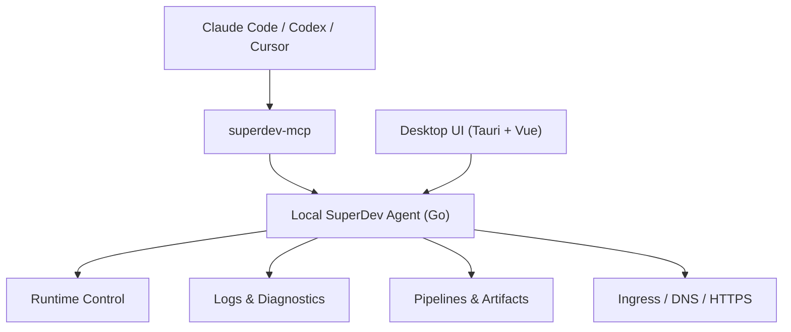

<p align="center">
  
</p>

<h1 align="center">SuperDev</h1>

<p align="center">
  <strong>An AI-native runtime collaboration layer.</strong><br />
  <strong>Give AI the same runtime you see: services, logs, deployments, approvals.</strong><br />
  Let developers and AI share services, logs, deployments, and approval context in one real environment.
</p>

<p align="center">
  <a href="https://gosuper.dev/"><strong>gosuper.dev</strong></a> ·
  <a href="#why-superdev">Why</a> ·
  <a href="#quick-start">Quick start</a> ·
  <a href="#architecture">Architecture</a> ·
  <a href="./README.zh-CN.md">简体中文</a>
</p>

<p align="center">
  <a href="https://gosuper.dev/">
    
  </a>
</p>

<p align="center">
  
  
  
  
  
  
  <a href="https://github.com/Xsxdot/super-dev/actions/workflows/ci.yml"></a>
</p>

## Why SuperDev

AI coding tools can read code, edit code, and run commands. But code collaboration only answers "what is in the repository." Real development depends on the runtime state that exists right now: which services are already running, which ports are occupied, which logs belong to the current feature, which pipeline just shipped, and which remote deployment is failing.

When AI cannot see that runtime state, it starts another service, competes for ports, and creates a shadow environment. Each conversation feels like a restart. AI cannot continuously follow a feature from local debugging, through log changes and pipeline runs, to a production error.

SuperDev brings local services, remote hosts, logs, pipelines, ingress, and approval context into one local-first source of truth, then exposes it to Claude Code, Codex, Cursor, and other coding agents through MCP. AI stops guessing from outside the repository and starts collaborating inside the same real development scene.

## First Goal: Shared Runtime Collaboration

SuperDev is not just diagnostics or remote control for AI. Its first goal is a new kind of collaboration: developers and AI agents working over the same runtime state.

That means AI sees the services you already started instead of starting another copy. It reads the same logs instead of asking you to paste fragments. It understands the current deployment, pipeline, ingress, and approval context instead of treating a production error as isolated text.

When AI and humans share runtime state, collaboration becomes continuous. A feature can be followed across services, logs, deployments, and edge state. A production error can be traced through the system that produced it. Real-environment actions can still stay behind preflight checks, human approval, one-time tokens, and audit logs.

## Highlights

Two things are the core — **shared runtime** and **safe operations**. They are what set SuperDev apart from code-layer tools; everything else exists to serve them.

### 🤝 Shared runtime, no competing services

- AI observes existing services, ports, logs, and deployments before deciding whether it needs to request an action.
- Avoid shadow environments, port contention, duplicate processes, and split runtime state.
- Follow one feature across local services, log changes, pipeline runs, remote deployments, and ingress.
- Treat production errors as shared runtime context, not pasted text detached from the system that produced it.

### 🔒 Safe AI operations

- `superdev-mcp` ships with the desktop app and connects to the local agent at `http://127.0.0.1:57017` by default.
- The bundled SuperDev skill teaches AI to build a global view first, collect evidence, reason explicitly, and only then execute safely.
- Runtime writes call `start/stop/restart` directly; when approval is required, MCP waits for desktop approval by default and resumes with a one-time token.
- Approval tokens are bound to an operation fingerprint, expire quickly, are single-use, and cannot be reused for a different target.
- Approvals, rejections, executions, and failures are recorded locally for audit.

### Capabilities built around those two

| Capability | What it does |
| --- | --- |
| **Unified runtime console** | See local processes, Launchd jobs, systemd services, Docker containers, and remote-host deployments in one model; choose managed control or monitor-only; desktop UI and MCP share one source of truth. |
| **Logs & diagnostics** | Live / historical logs, cross-service search, context lookup, filter rules, split panels, synchronized recording, bookmark ranges, repeated-log folding. Diagnostics give deterministic evidence; AI owns the root-cause reasoning. |
| **Production-minded pipelines** | DAG pipelines, reusable templates, variables, artifacts, run history, replayable run logs; built-in Go / Node / Python / Java / Rust / PHP / Vue+Go templates; systemd uses a release/current layout, rollback reuses the same path. |
| **Declarative ingress** | Pipelines deliver artifacts repeatedly; Ingress converges long-lived edge state: domains, DNS, reverse proxy, HTTPS, managed certs. Supports nginx, manual DNS, Cloudflare, Aliyun, ACME DNS-01, and orphan detection. |

### Zero-touch onboarding

- Choose Claude Code, Codex, or Cursor on first launch.
- Install the MCP connection and the SuperDev guide skill from the desktop app.
- Seed a local `superdev-sample` project automatically.
- Copy one prompt to AI and watch the full loop: inspect logs, request approval, approve in the desktop app, and let MCP continue automatically.

## Quick Start

### Run from source

```bash
git clone https://github.com/Xsxdot/super-dev.git
cd super-dev
cd desktop
pnpm install
pnpm tauri dev
```

> macOS app download instructions will be added after the first public release package is verified. This README intentionally avoids unverified release links.

### Try the AI safety demo

1. Open SuperDev.
2. Pick Claude Code, Codex, or Cursor during onboarding.
3. Install the MCP connection.
4. Copy the generated prompt into your AI coding agent.
5. When AI asks to restart the sample service, approve it in SuperDev Operation Approvals.
6. MCP fetches the one-time approval token and continues the restart; AI reads logs again and explains the WARN/ERROR lines.

## Architecture



The important boundary is the local agent. It is the runtime gateway and source of truth. MCP does not bypass the agent to edit config files, SQLite, processes, or remote hosts. The safety gate is enforced in the agent layer, not merely suggested by prompts.

## Examples and Templates

`examples/` contains small projects used to validate built-in pipeline templates:

| Example | Template | Runtime |
| --- | --- | --- |
| `go-http` | `go-binary-build` | Go binary |
| `node-http` | `node-standard-build` | Node |
| `python-http` | `python-standard-build` | Python |
| `java-springboot` | `java-maven-build` | Java Spring Boot |
| `rust-http` | `rust-cargo-build` | Rust binary |
| `php-http` | `php-standard-build` | PHP built-in server |
| `vue-go-combined` | `vue-go-combined-build` | Go serving Vue dist |
| `mcp-log-lab` | runtime/log diagnostics fixture | Go command services |

Ingress examples live in `examples/ingress/` and cover manual DNS, Cloudflare, Aliyun, nginx, and TLS declarations.

## Status and Roadmap

SuperDev is approaching its first open-source release. The current focus is macOS desktop usage and local-first workflows.

- Available: Tauri desktop app, Go local agent, MCP server, SuperDev skill, multi-service logs, operation approvals, pipeline templates, ingress, and zero-touch onboarding.
- Near term: verified release packaging, final README screenshots, more pipeline templates, a smoother remote agent / tunnel experience, and a demo video.
- Principle: local-first by default. AI can participate in operations, but writes must remain preflighted, approved, token-bound, and auditable.

## Development

```bash
# Desktop
cd desktop
pnpm install --frozen-lockfile
pnpm build          # Frontend type-check + vite build (does not package the desktop app)
pnpm test           # Frontend unit tests (vitest)
pnpm tauri build    # Package the macOS desktop app (produces an installer, does not launch it)

# Agent
cd agent
go test ./...
```

> `pnpm build` only builds frontend assets. To package the full macOS desktop app use `pnpm tauri build`; to just run it and see it live use `pnpm tauri dev`.

Tauri builds package sidecar binaries through `desktop/scripts/build-agent.sh`: `superdev-agent`, `superdev-mcp`, and `superdev-sample`.

## Open Source Governance

- Contribution guide: [CONTRIBUTING.md](./CONTRIBUTING.md)
- Security reports: [SECURITY.md](./SECURITY.md)
- Versioning and releases: [docs/release.md](./docs/release.md)
- Changelog: [CHANGELOG.md](./CHANGELOG.md)

## Contributing

Contributions are welcome: pipeline templates, runtime adapters, log diagnostics, ingress providers, documentation, and example projects. Please include reproducible verification commands in PRs when possible. For changes that touch runtime writes, preserve the preview, approval, and audit boundaries.

## License

See [LICENSE](./LICENSE).
