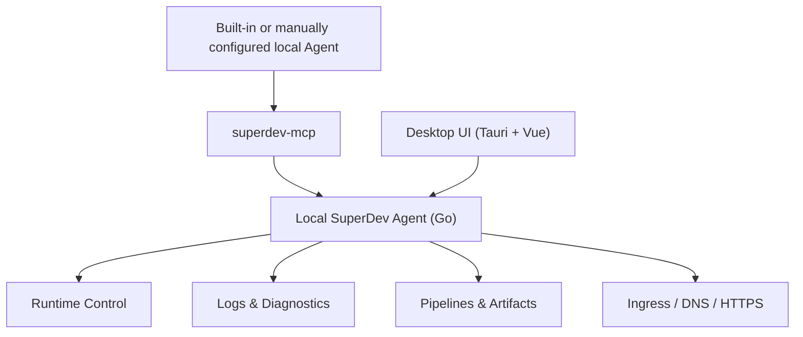

<p align="center">
  
</p>

<h1 align="center">SuperDev</h1>

<p align="center">
  <strong>Your AI writes code — but in the real environment it's blind and handcuffed.</strong><br />
  <strong>SuperDev gives it the full workbench: See (runtime + logs), Inspect (breakpoint debugging), Operate (browser + deploys).</strong><br />
  Across every local and remote project, in one place.
</p>

<p align="center">
  <a href="https://gosuper.dev/"><strong>gosuper.dev</strong></a> ·
  <a href="#why-superdev">Why</a> ·
  <a href="#see-inspect-operate">See · Inspect · Operate</a> ·
  <a href="#quick-start">Quick start</a> ·
  <a href="#architecture">Architecture</a> ·
  <a href="./README.zh-CN.md">简体中文</a>
</p>

<p align="center">
  <a href="https://gosuper.dev/">
    
  </a>
</p>

> **Watch the workflow:** choose an AI agent, install MCP, add a host, let AI create the project, services, environments, pipeline and deployment, approve operations, and arrive at the shared runtime overview: [gosuper.dev/#demo](https://gosuper.dev/#demo).

<p align="center">
  
  
  
  
  
  
  <a href="https://github.com/Xsxdot/super-dev/actions/workflows/ci.yml"></a>
</p>

## Why SuperDev

AI coding tools can read, edit, and run code. But that only answers "what's in the repo." Real development happens in the runtime: which services are up, which ports are taken, which logs belong to this feature, where a bug actually is, and whether the frontend you just changed even renders.

A human developer has a full toolbox for this — a process list, a log viewer, a debugger that stops on a line, a browser to click through the UI. Your AI has almost none of it. It writes the code, then goes blind: it can't see the running service, can't step through the bug, can't tell if the page broke. So it guesses, restarts services it can't see, and asks you to paste logs.

SuperDev gives AI the same workbench you use — **See, Inspect, Operate** — over one source of runtime truth that the desktop app and AI share, across every local and remote project.

## See, Inspect, Operate

A human developer doesn't just read code — they watch it run, stop it mid-flight to inspect state, and drive the UI to confirm it works. SuperDev gives AI all three.

### 👁 See — runtime and logs

AI sees the services already running (no shadow copies, no port contention), and reads the same live/historical logs you do — cross-service search, context lookup, folding, bookmarks — instead of asking you to paste fragments. Diagnostics give deterministic evidence; AI owns the root-cause reasoning.

### 🔬 Inspect — breakpoint debugging

When logs aren't enough, AI attaches to a running managed process (no restart, same pid), stops on a source line, and reads the call stack, scopes, and variables in one call. Default support covers **Go, Python, Rust, C/C++**; **experimental support covers Node and Java/Kotlin** (bring your own / configured adapter). Exposed over MCP as `list_code_debug_targets` and `debug_capture_at`.

### 🎮 Operate — browser and deploys

AI changes the frontend, then verifies it itself: navigate, click, type, screenshot, read console logs and network requests, and (when authorized) evaluate JS in the page — driven through Playwright. For shipping, AI runs the same DAG pipelines you do. Every real-environment action stays behind preflight, approval, one-time tokens, and audit.

## Highlights

See / Inspect / Operate is what AI does. Two things make it trustworthy and continuous — **one shared source of runtime truth** and **safe operations**. Everything below serves those.

### 🤝 Shared runtime, no competing services

- AI observes existing services, ports, logs, and deployments before deciding whether it needs to request an action.
- Avoid shadow environments, port contention, duplicate processes, and split runtime state.
- Follow one feature across local services, log changes, pipeline runs, remote deployments, and ingress.
- Treat production errors as shared runtime context, not pasted text detached from the system that produced it.

### 🔒 Safe AI operations

- `superdev-mcp` ships with the desktop app and connects to the local agent at `http://127.0.0.1:57017` by default.
- The bundled SuperDev skill teaches AI to build a global view first, collect evidence, reason explicitly, and only then execute safely.
- Runtime writes call `start/stop/restart` directly; when approval is required, MCP waits for desktop approval by default and resumes with a one-time token.
- Approval tokens are bound to an operation fingerprint, expire quickly, are single-use, and cannot be reused for a different target.
- Approvals, rejections, executions, and failures are recorded locally for audit.
- Browser control (navigate / click / evaluate) runs under the same model: `open` requests approval, `evaluate` is gated by a trust toggle rather than per-call prompts, and control actions are redacted in the audit log.

### Capabilities built around those two

| Capability | What it does |
| --- | --- |
| **Unified runtime console** | See local processes, Launchd jobs, systemd services, Docker containers, and remote-host deployments in one model; choose managed control or monitor-only; desktop UI and MCP share one source of truth. |
| **Logs & diagnostics** | Live / historical logs, cross-service search, context lookup, filter rules, split panels, synchronized recording, bookmark ranges, repeated-log folding. Diagnostics give deterministic evidence; AI owns the root-cause reasoning. |
| **AI breakpoint debugging** | When logs aren't enough, AI attaches to a running managed process (no restart, same pid), stops on a source line, and reads call stack / scopes / variables in one call. Default support: Go, Python, Rust, C/C++. Experimental (bring/configure adapter): Node, Java/Kotlin. Exposed over MCP as `list_code_debug_targets` / `debug_capture_at`. |
| **Browser control** | AI drives the running frontend through Playwright: `browser_navigate` / `browser_click` / `browser_type` / `browser_screenshot` / `browser_set_viewport` / `browser_console_logs` / `browser_network_requests` / `browser_evaluate`, plus snapshot, reload, wait-for-selector, press-key, select-option. Verifies its own UI changes; control actions stay under approval + redacted audit. |
| **Production-minded pipelines** | DAG pipelines, reusable templates, variables, artifacts, run history, replayable run logs; built-in Go / Node / Python / Java / Rust / PHP / Vue+Go templates; systemd uses a release/current layout, rollback reuses the same path. |
| **Declarative ingress** | Pipelines deliver artifacts repeatedly; Ingress converges long-lived edge state: domains, DNS, reverse proxy, HTTPS, managed certs. Supports nginx, manual DNS, Cloudflare, Aliyun, ACME DNS-01, and orphan detection. |

### Zero-touch onboarding

- Choose any detected built-in Connector on first launch. Claude Code, Codex, and Cursor are currently verified automatic Connectors; other local MCP-capable Agents can be connected manually with the standard stdio instructions.
- Cloud or isolated-sandbox Agents cannot reach the local `127.0.0.1` endpoint; they require a future authenticated Remote MCP Gateway and are not presented with a misleading local configuration.
- Install the MCP connection and the SuperDev guide skill from the desktop app.
- Seed a local `superdev-sample` project automatically.
- Copy one prompt to AI and watch the full loop: inspect logs, request approval, approve in the desktop app, and let MCP continue automatically.

## Quick Start

### Run from source

```bash
git clone https://github.com/Xsxdot/super-dev.git
cd super-dev
cd desktop
pnpm install
pnpm tauri dev
```

> macOS app download instructions will be added after the first public release package is verified. This README intentionally avoids unverified release links.

### Try the AI safety demo

1. Open SuperDev.
2. Pick a detected Connector during onboarding, or open the manual setup instructions for another local MCP Agent.
3. Install the MCP connection.
4. Copy the generated prompt into your AI coding agent.
5. When AI asks to restart the sample service, approve it in SuperDev Operation Approvals.
6. MCP fetches the one-time approval token and continues the restart; AI reads logs again and explains the WARN/ERROR lines.

## Architecture



The important boundary is the local agent. It is the runtime gateway and source of truth. MCP does not bypass the agent to edit config files, SQLite, processes, or remote hosts. The safety gate is enforced in the agent layer, not merely suggested by prompts.

## Examples and Templates

`examples/` contains small projects used to validate built-in pipeline templates:

| Example | Template | Runtime |
| --- | --- | --- |
| `go-http` | `go-binary-build` | Go binary |
| `node-http` | `node-standard-build` | Node |
| `python-http` | `python-standard-build` | Python |
| `java-springboot` | `java-maven-build` | Java Spring Boot |
| `rust-http` | `rust-cargo-build` | Rust binary |
| `php-http` | `php-standard-build` | PHP built-in server |
| `vue-go-combined` | `vue-go-combined-build` | Go serving Vue dist |
| `mcp-log-lab` | runtime/log diagnostics fixture | Go command services |

Ingress examples live in `examples/ingress/` and cover manual DNS, Cloudflare, Aliyun, nginx, and TLS declarations.

## Status and Roadmap

SuperDev is approaching its first open-source release. The current focus is macOS desktop usage and local-first workflows.

- Available: Tauri desktop app, Go local agent, MCP server, SuperDev skill, multi-service logs, breakpoint debugging (Go/Python/Rust/C++ by default; Node and Java/Kotlin experimental), browser control (Playwright-driven), operation approvals, pipeline templates, ingress, and zero-touch onboarding.
- Near term: verified release packaging, final README screenshots, more pipeline templates, a smoother remote agent / tunnel experience, and a richer release walkthrough.
- Principle: local-first by default. AI can participate in operations, but writes must remain preflighted, approved, token-bound, and auditable.

## Platform Support

| Platform | Local desktop app | Remote agent install target | Go/Python/Rust/C/C++ debugging | Node debugging | JVM debugging |
| --- | --- | --- | --- | --- | --- |
| macOS (`darwin`) | Supported with Tauri sidecars. | `superdev-agent-darwin-amd64` and `superdev-agent-darwin-arm64`. | Supported by the default attach flow when the language debugger is installed. | Experimental attach via `SIGUSR1` inspector activation. | Experimental; bring or configure the JVM adapter. |
| Linux | Covered by `desktop-linux` CI packaging. | `superdev-agent-linux-amd64` and `superdev-agent-linux-arm64`. | Supported by the default attach flow when the language debugger is installed. | Experimental attach via `SIGUSR1` inspector activation. | Experimental; bring or configure the JVM adapter. |
| Windows | Covered by `desktop-windows` CI packaging with `.exe` sidecars. | `superdev-agent-windows-amd64.exe`. | Supported by the default attach flow when the matching debugger toolchain is available. | Experimental prearm flow using `--inspect=0` instead of Unix signals. | Experimental; bring or configure the JVM adapter. |

## Development

```bash
# Desktop
cd desktop
pnpm install --frozen-lockfile
pnpm build          # Frontend type-check + vite build (does not package the desktop app)
pnpm test           # Frontend unit tests (vitest)
pnpm tauri build    # Package the macOS desktop app (produces an installer, does not launch it)

# Agent
cd agent
go test ./...
```

> `pnpm build` only builds frontend assets. To package the full macOS desktop app use `pnpm tauri build`; to just run it and see it live use `pnpm tauri dev`.

Tauri builds package sidecar binaries through `desktop/scripts/build-agent.sh`: `superdev-agent`, `superdev-mcp`, and `superdev-sample`.

## Open Source Governance

- Contribution guide: [CONTRIBUTING.md](./CONTRIBUTING.md)
- Security reports: [SECURITY.md](./SECURITY.md)
- Versioning and releases: [docs/release.md](./docs/release.md)
- Changelog: [CHANGELOG.md](./CHANGELOG.md)

## Contributing

Contributions are welcome: pipeline templates, runtime adapters, log diagnostics, ingress providers, documentation, and example projects. Please include reproducible verification commands in PRs when possible. For changes that touch runtime writes, preserve the preview, approval, and audit boundaries.

## License

See [LICENSE](./LICENSE).
