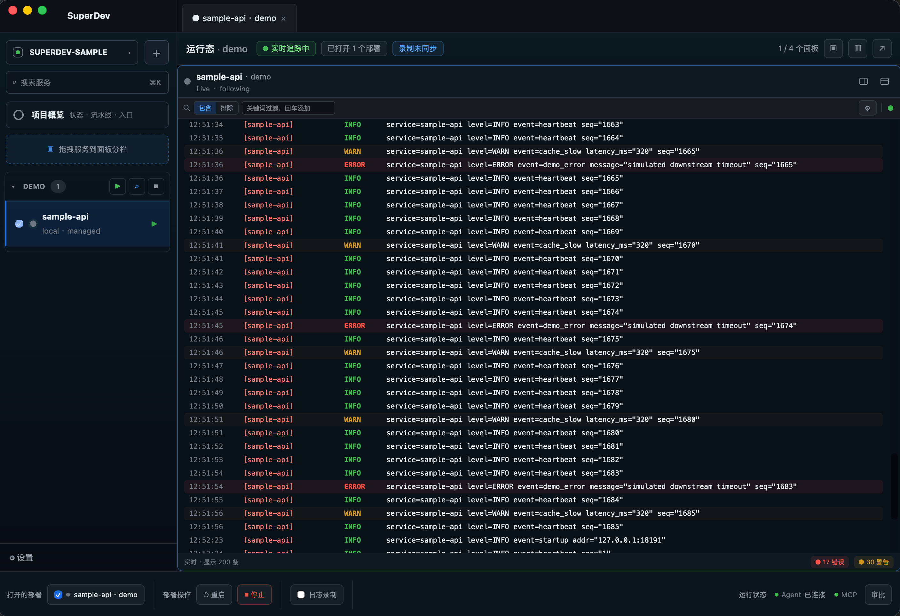
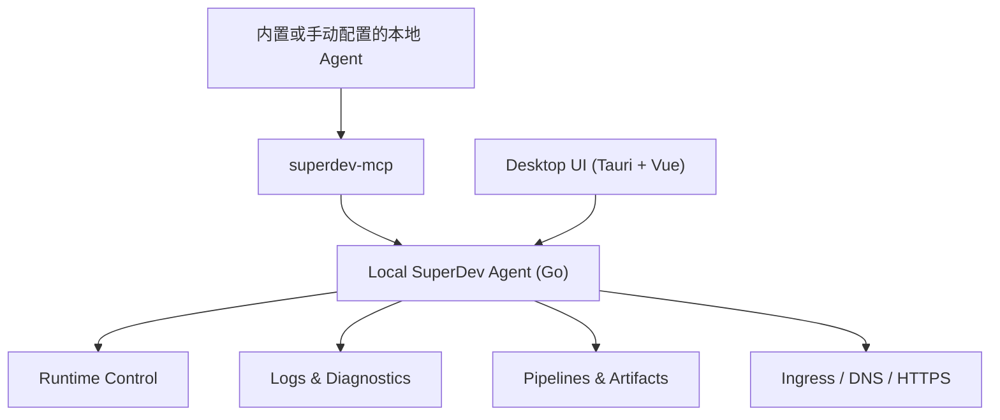

<p align="center">
  
</p>

<h1 align="center">SuperDev</h1>

<p align="center">
  <strong>你的 AI 会改代码，但它在真实环境里又盲又瘸。</strong><br />
  <strong>SuperDev 给它一套完整工作台：看（运行态 + 日志）、查（断点调试）、操（浏览器 + 部署）。</strong><br />
  跨本地与远端的所有项目，一个地方。
</p>

<p align="center">
  <a href="https://gosuper.dev/"><strong>官网 gosuper.dev</strong></a> ·
  <a href="#为什么是-superdev">为什么</a> ·
  <a href="#看--查--操">看 · 查 · 操</a> ·
  <a href="#快速开始">快速开始</a> ·
  <a href="#核心架构">架构</a> ·
  <a href="./README.md">English</a>
</p>

<p align="center">
  <a href="https://gosuper.dev/">
    
  </a>
</p>

> **观看完整流程：** 选择 AI 工具、安装 MCP、新增主机，让 AI 创建项目、服务、环境、流水线和部署，完成必要审批，并得到共享运行态总览：[gosuper.dev/#demo](https://gosuper.dev/#demo)。

<p align="center">
  
  
  
  
  
  
  <a href="https://github.com/Xsxdot/super-dev/actions/workflows/ci.yml"></a>
</p>

## 为什么是 SuperDev

AI 编程工具已经能读代码、改代码、跑命令，但这只解决了「仓库里有什么」。真正的开发发生在运行态：哪些服务在跑、哪个端口被占、哪段日志属于当前功能、bug 究竟卡在哪一行、你刚改的前端到底渲染没渲染。

人类开发者有一整套工具应对这些——进程列表、日志面板、能停在某一行的调试器、点点点验证 UI 的浏览器。你的 AI 几乎一样都没有。它改完代码就「瞎」了：看不到正在跑的服务、没法单步追 bug、不知道页面崩没崩。于是它只能猜，另起一套它看不见的服务，再让你复制粘贴日志。

SuperDev 把你用的这套工作台——**看、查、操**——交给 AI，建立在桌面端与 AI 共享的同一份运行态事实源之上，覆盖本地与远端的每一个项目。

## 看 · 查 · 操

人类开发者不只是读代码——他们看着代码运行、在执行中途停下来检查状态、驱动 UI 确认它真能用。SuperDev 把这三件事都给了 AI。

### 👁 看 — 运行态与日志

AI 看见已经在跑的服务（不再起影子副本、不再抢端口），读你读的同一份实时/历史日志——跨服务搜索、上下文定位、折叠、书签——而不是让你贴片段。诊断给确定性证据，根因推理由 AI 自己完成。

### 🔬 查 — 断点调试

日志不够时，AI attach 到正在跑的受管进程（不重启、同 pid），停在某一行，一次调用读出调用栈、作用域和变量。**开箱即用：Go、Python、Rust、C/C++**；
**实验性：Node 与 Java/Kotlin**（需自备 / 配置 adapter）。通过 MCP 暴露为 `list_code_debug_targets` 和 `debug_capture_at`。

### 🎮 操 — 浏览器与部署

AI 改完前端，自己验证：导航、点击、输入、截图、读 console 日志和 network 请求，并在授权时在页面里执行 JS——全部经 Playwright 驱动。要发布时，AI 跑你跑的同一套 DAG 流水线。所有真实环境操作都在预检、审批、一次性 token 和审计之下。

## 高光功能

看 / 查 / 操是 AI 做的事。两件事让它可信且连续——**同一份运行态事实源**和**安全操作**。下面的一切都为这两点服务。

### 🤝 共享运行态，不抢占用户服务

- AI 先观察已有服务、端口、日志和部署状态，再决定是否需要请求操作。
- 避免 AI 另起一套 shadow environment，减少端口竞争、重复进程和状态分叉。
- 同一项功能可以从本地运行、日志变化、pipeline run、远端 deployment 到 ingress 持续追踪。
- 线上错误不再只是贴给 AI 的一段文本，而是能被放回服务、部署、日志和入口上下文里共同处理。

### 🔒 AI 安全操作真实环境

- `superdev-mcp` 随桌面端分发，默认连接本机 agent：`http://127.0.0.1:57017`。
- 内置 SuperDev skill，指导 AI 按“先建立全局视野、再采证、再推理、最后安全执行”的顺序使用工具。
- 运行态写操作直接调用 `start/stop/restart`；需要审批时 MCP 默认等待桌面端批准，并用一次性 token 自动续跑。
- 审批 token 与具体 operation fingerprint 绑定，短期有效、一次性使用、不可换目标复用。
- 审批、拒绝、执行和失败都会进入本地审计记录。
- 浏览器控制（导航 / 点击 / evaluate）走同一套模型：`open` 走审批，`evaluate` 由信任开关授信而非逐次弹审批，控制动作在审计里脱敏。

### 围绕这两点的能力

| 能力 | 说明 |
| --- | --- |
| **多服务运行态控制台** | 统一查看本地进程、Launchd、systemd、Docker、远程主机上的 service / deployment；支持 managed control 与 monitor-only 两种模式；桌面端与 MCP 共享同一份运行态模型。 |
| **日志聚合与诊断** | 实时 / 历史日志、跨服务搜索、上下文查看、规则过滤、面板分栏、同步录制、书签区间、折叠重复日志。诊断只给确定性证据，根因推理留给 AI。 |
| **AI 代码断点调试** | 日志看不出根因时，AI attach 到正在跑的受管进程（不重启、不换 pid），停在某一行源码，一次拿到调用栈 / 作用域 / 变量。默认支持：Go、Python、Rust、C/C++。实验性（需自备 / 配置 adapter）：Node、Java/Kotlin。经 MCP 暴露为 `list_code_debug_targets` / `debug_capture_at`。 |
| **浏览器控制** | AI 通过 Playwright 驱动正在运行的前端：`browser_navigate` / `browser_click` / `browser_type` / `browser_screenshot` / `browser_set_viewport` / `browser_console_logs` / `browser_network_requests` / `browser_evaluate`，并支持 snapshot、reload、wait-for-selector、press-key、select-option。AI 自己验证 UI 改动；控制动作仍在审批和脱敏审计之下。 |
| **生产级 pipeline 底座** | DAG pipeline、模板组合、变量系统、artifact、run history、run log replay；内置 Go / Node / Python / Java / Rust / PHP / Vue+Go 模板；systemd 采用 release/current 结构，回滚复用同一条路径。 |
| **Ingress 声明式入口** | pipeline 管“反复投递产物”，Ingress 管“长期存在的入口状态”：域名、DNS、反向代理、HTTPS、证书托管。支持 nginx、manual DNS、Cloudflare、Aliyun、ACME DNS-01 与 orphan detection。 |

### 零操作 onboarding

- 首次打开引导页选择检测到的内置 Connector。目前 Claude Code、Codex、Cursor 已验证支持自动接入；其他支持本地 MCP 的 Agent 可按标准 stdio 指引手动接入。
- 云端或隔离沙箱 Agent 无法访问本机 `127.0.0.1` endpoint；它们需要未来带鉴权的 Remote MCP Gateway，界面不会误导用户复制本机配置。
- 一键安装 MCP 连接和 SuperDev 使用指南 skill。
- 自动落地 `superdev-sample` 示例项目。
- 复制一段提示词给 AI，即可体验“看日志 -> 触发审批 -> 用户批准 -> MCP 自动继续执行”的闭环。

## 快速开始

### 从源码运行

```bash
git clone https://github.com/Xsxdot/super-dev.git
cd super-dev
cd desktop
pnpm install
pnpm tauri dev
```

> 首个公开 release 打包完成后，这里会补充 macOS 应用下载方式。当前 README 不提供未验证的下载链接。

### 体验 AI 安全演示

1. 打开 SuperDev。
2. 在 onboarding 中选择检测到的 Connector，或打开其他本地 MCP Agent 的手动接入指引。
3. 点击安装 MCP 连接。
4. 复制页面给出的提示词并发给 AI。
5. 当 AI 请求重启示例服务时，在 SuperDev 的“操作审批”中批准。
6. MCP 自动获取一次性 approval token 并继续执行；AI 再次读取日志解释 WARN/ERROR。

## 核心架构



SuperDev 的关键边界是：local agent 是运行态网关和事实源。MCP 不绕过 agent 直接读写配置、SQLite、进程或远程机器；安全门禁也在 agent 层强制执行，而不是只靠提示词约束 AI。

## 示例与模板

`examples/` 提供用于验证内置 pipeline 模板的最小项目：

| Example | Template | Runtime |
| --- | --- | --- |
| `go-http` | `go-binary-build` | Go binary |
| `node-http` | `node-standard-build` | Node |
| `python-http` | `python-standard-build` | Python |
| `java-springboot` | `java-maven-build` | Java Spring Boot |
| `rust-http` | `rust-cargo-build` | Rust binary |
| `php-http` | `php-standard-build` | PHP built-in server |
| `vue-go-combined` | `vue-go-combined-build` | Go serving Vue dist |
| `mcp-log-lab` | runtime/log diagnostics fixture | Go command services |

Ingress 示例位于 `examples/ingress/`，覆盖 manual DNS、Cloudflare、Aliyun、nginx 和 TLS 配置。

## 当前状态与路线图

SuperDev 正处于第一版开源发布前夜，当前主要面向 macOS 桌面端和本地优先工作流。

- 已有：Tauri 桌面端、Go local agent、MCP server、SuperDev skill、多服务日志、断点调试（Go/Python/Rust/C++ 默认支持；Node 与 Java/Kotlin experimental）、浏览器控制（Playwright 驱动）、operation approvals、pipeline 模板、ingress 子系统、零操作 onboarding。
- 近期：更完整的 release 打包、正式 README 截图、更多 pipeline 模板、更稳的远端 agent / tunnel 体验、更完整的发布演示。
- 原则：本地优先，不把控制面强行放到云上；AI 可以参与操作，但写操作必须可预检、可批准、可审计。

## 平台支持

| 平台 | 本地桌面端 | 远端 agent 安装目标 | Go/Python/Rust/C/C++ 调试 | Node 调试 | JVM 调试 |
| --- | --- | --- | --- | --- | --- |
| macOS (`darwin`) | 支持，随 Tauri sidecar 打包。 | `superdev-agent-darwin-amd64` 与 `superdev-agent-darwin-arm64`。 | 安装对应语言调试器后走默认 attach 流程。 | experimental，通过 `SIGUSR1` 打开 inspector。 | experimental，需自备或配置 JVM adapter。 |
| Linux | `desktop-linux` CI 覆盖打包。 | `superdev-agent-linux-amd64` 与 `superdev-agent-linux-arm64`。 | 安装对应语言调试器后走默认 attach 流程。 | experimental，通过 `SIGUSR1` 打开 inspector。 | experimental，需自备或配置 JVM adapter。 |
| Windows | `desktop-windows` CI 覆盖打包，并使用 `.exe` sidecar。 | `superdev-agent-windows-amd64.exe`。 | 对应调试工具链可用时走默认 attach 流程。 | experimental，使用预注入 `--inspect=0`，不依赖 Unix signal。 | experimental，需自备或配置 JVM adapter。 |

## 开发

```bash
# Desktop
cd desktop
pnpm install --frozen-lockfile
pnpm build          # 前端类型检查 + vite 构建（不打包桌面端）
pnpm test           # 前端单元测试（vitest）
pnpm tauri build    # 打包 macOS 桌面应用（产出安装包，不会启动应用）

# Agent
cd agent
go test ./...
```

> `pnpm build` 只构建前端资源；要打包完整的 macOS 桌面应用用 `pnpm tauri build`，想直接运行起来看效果用 `pnpm tauri dev`。

Tauri 构建会通过 `desktop/scripts/build-agent.sh` 打包 sidecar 二进制：`superdev-agent`、`superdev-mcp`、`superdev-sample`。

## 开源治理

- 贡献指南：[CONTRIBUTING.md](./CONTRIBUTING.md)
- 安全报告：[SECURITY.md](./SECURITY.md)
- 版本与发布：[docs/release.md](./docs/release.md)
- 变更日志：[CHANGELOG.md](./CHANGELOG.md)

## 贡献

欢迎贡献 pipeline 模板、运行时适配器、日志诊断能力、ingress provider、文档和示例项目。提交 PR 前请尽量附上可复现的验证命令；涉及运行态写操作时，请保持 preview、approval 和 audit 的安全边界。

## License

查看 [LICENSE](./LICENSE)。
