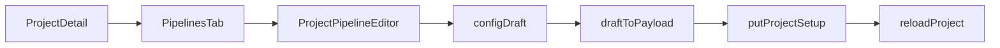
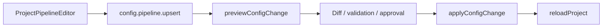

# Pipeline UI Integration Design

日期：2026-06-09

状态：设计稿，待评审

## 背景

临时静态原型已经验证了两类核心界面：

- 流水线总览：项目级流水线列表、最近运行状态、历史记录、右侧概览。
- 流水线编辑：基础信息、阶段结构、模板输入、预览、保存动作。

真实代码中已经存在对应基础能力：

- `desktop/src/components/Overview/PipelinesTab.vue` 负责项目流水线总览与运行操作。
- `desktop/src/components/Overview/PipelineRow.vue` 负责单条流水线行。
- `desktop/src/components/Overview/RunHistoryList.vue` 负责历史运行列表。
- `desktop/src/components/Settings/ProjectPipelineEditor.vue` 负责项目流水线编辑入口与保存。
- `desktop/src/components/Settings/SingleProjectPipelineForm.vue` 负责单条流水线基础配置。
- `desktop/src/components/Settings/PipelineTemplateWizard.vue` 负责模板编排与输入。
- `desktop/src/components/Settings/PipelinePreview.vue` 负责流水线预览。
- `agent/configchange` 已支持 `config.pipeline.upsert`，但当前前端流水线编辑仍通过完整项目配置保存。

本方案的目标不是把静态页整体搬进项目，而是将原型中已经跑通的产品结构、信息密度和流程关系，落到现有组件和数据流上。

## 产品目标

用户在同一个项目页中应能完成完整闭环：

1. 看到项目有哪些流水线，以及最近是否健康。
2. 展开一条流水线，快速判断最近版本、耗时、失败原因和是否正在运行。
3. 从同一条流水线进入编辑，不需要跳到另一个心智模型。
4. 编辑时能清楚区分“基础配置”“阶段模板”“模板输入”“最终预览”。
5. 保存前能理解这次变更会影响哪条流水线，后续再升级为后端配置变更预览。

## 非目标

- 不在第一阶段改变 `ProjectPipeline` 数据模型。
- 不在第一阶段改变流水线执行引擎或模板 DSL。
- 不在第一阶段引入新的路由页面，仍以当前项目上下文内的弹窗/面板为主。
- 不在第一阶段替换保存链路为 `configchange`，只为后续升级留出边界。
- 不实现流水线删除、批量操作、权限模型、制品下载等新增后端能力。

## 分阶段方案

### 第一阶段：UI 集成 MVP

第一阶段只改前端表现和交互组织，复用现有 API 与数据模型。

总览页：

- `PipelinesTab.vue` 保留当前项目级入口，调整为“统计栏 + 流水线列表 + 右侧概览”的工作台布局。
- `PipelineRow.vue` 承担单行的名称、服务标签、最新状态、最近版本、耗时、最近运行和操作区。
- `RunHistoryList.vue` 改为稳定的历史行布局，时间线位置由行高和 header 高度共同决定，避免图标落入表头或行高被按钮撑开。
- 右侧概览只读取当前选中流水线和已有运行数据，不引入编辑副作用。

编辑器：

- `ProjectPipelineEditor.vue` 继续作为编辑弹窗的状态边界，负责草稿、保存、错误、加载状态。
- `SingleProjectPipelineForm.vue` 聚焦基础配置：流水线名称、制品类型、关联服务、变量、环境。
- `PipelineTemplateWizard.vue` 改为更接近原型的三段结构：左侧阶段结构、中间模板卡片、右侧模板输入。
- `PipelinePreview.vue` 保持只读，作为底部预览条或预览区展示当前草稿结构。
- 保存仍走 `api.putProjectSetup(project.id, draftToPayload(draft))`，保存后调用 `reloadProject()`。

### 第二阶段：安全保存链路

当第一阶段 UI 稳定后，再将保存链路升级为配置变更流程。

建议新增前端 API 封装：

- `previewConfigChange(projectID, operation)` 对应 `/api/config-changes/preview`。
- `applyConfigChange(changeID)` 对应 `/api/config-changes/apply`。

编辑器保存流程调整为：

1. 用户点击保存。
2. 前端构造 `config.pipeline.upsert` 操作。
3. 后端返回 diff、validation、approval 状态。
4. 无阻断错误时进入确认。
5. 需要审批时走现有 operation approval 流程。
6. 应用成功后刷新项目配置。

这个阶段的价值是把“保存配置”从全量项目覆盖，升级为可预览、可审计、可审批的单流水线变更。

### 第三阶段：运行体验增强

第三阶段再补运行侧深度能力：

- 从失败历史直接进入日志或控制台。
- 展示最近制品与可下载入口。
- 为运行中的流水线提供更明确的阶段进度。
- 将回滚入口和失败版本的关系展示得更清楚。

这些能力需要以后端运行记录、日志、制品接口的实际支持为边界。

## 架构边界

- 总览组件只展示运行态和打开编辑器，不直接修改 pipeline draft。
- 编辑器组件只处理配置草稿，不订阅运行历史和控制台状态。
- 模板向导只编辑模板 block 与输入值，不解析后端 YAML。
- 预览组件只读展示，不承担保存或校验职责。
- API 层负责把前端交互意图翻译成后端契约，组件不拼接裸 HTTP 路径。

这个边界可以保证第一阶段 UI 调整不会把运行态、配置态和保存态揉在一起。

## 组件落点

### `PipelinesTab.vue`

职责：

- 聚合项目流水线列表、运行历史、选中态和编辑入口。
- 根据现有运行结果计算统计指标。
- 将选中流水线传给右侧概览。

主要变化：

- 增加顶部统计区：流水线数量、最近成功、失败、运行中。
- 将列表和概览拆成主次区域，保持当前项目上下文。
- 统一运行、编辑、更多操作的按钮密度和位置。

### `PipelineRow.vue`

职责：

- 展示一条流水线的可扫描摘要。
- 承接展开/收起、运行、编辑等行级操作。

主要变化：

- 服务标签使用更紧凑的 chip。
- 最新状态用状态徽标，不用长说明文字。
- 操作区稳定宽度，避免不同状态下按钮导致列宽跳动。

### `RunHistoryList.vue`

职责：

- 展示单条流水线的最近运行记录。
- 提供控制台、日志、回滚等历史行操作。

主要变化：

- 表头、行高、时间线节点使用明确尺寸。
- 失败摘要单行截断，完整信息通过 tooltip 或后续详情承载。
- 操作按钮不使用破坏 table-cell 的 flex 布局。

### `ProjectPipelineEditor.vue`

职责：

- 作为编辑会话边界，维护 project draft 与保存流程。
- 协调基础表单、模板向导和预览。

主要变化：

- 弹窗布局改为 header、body、footer 三段。
- header 展示标题、项目标识、查看 YAML、保存。
- body 内部按“配置结构、阶段编辑、模板输入”分区。
- footer 展示预览、必填状态和保存动作。

### `SingleProjectPipelineForm.vue`

职责：

- 编辑流水线元信息和通用字段。

主要变化：

- 从完整表单视觉改为顶部基础配置区。
- 保留字段验证，但不承担模板阶段编辑。

### `PipelineTemplateWizard.vue`

职责：

- 管理 build、deploy、finally 阶段的模板 block。
- 根据当前模板生成输入控件。

主要变化：

- 左侧阶段结构展示每个阶段模板数量和完成状态。
- 中间按阶段展示模板卡片，支持选择、添加、移除。
- 右侧展示当前模板输入，按运行机器、路径、命令、文件、可选项分组。
- 底部预览条展示阶段执行图，保持只读。

## 数据与保存流程

第一阶段数据流保持不变：

第二阶段目标数据流：

第一阶段不需要后端迁移；第二阶段需要补前端 API 类型、错误展示和审批态 UI。

## 测试策略

第一阶段：

- 更新 `PipelinesTab` 相关测试，覆盖统计值、选中态、编辑入口、运行按钮。
- 更新 `RunHistoryList` 测试，覆盖五类状态、操作按钮、失败摘要截断结构。
- 更新 `ProjectPipelineEditor` 测试，覆盖草稿加载、保存成功、保存失败、关闭保护。
- 更新 `PipelineTemplateWizard` 测试，覆盖阶段切换、模板选择、输入更新、预览同步。
- 运行 `desktop` 的相关单元测试和构建检查。

第二阶段：

- 为 config change API 封装增加单元测试。
- 为 preview/apply 状态机增加组件测试。
- 覆盖 validation error、approval required、apply success、apply failure。

视觉验证：

- 使用浏览器截图检查总览与编辑器的 desktop 宽度。
- 特别检查历史时间线节点是否与历史行垂直居中。
- 检查长服务名、长版本号、长失败信息不会挤破布局。

## 验收标准

第一阶段完成时：

- 项目流水线总览能呈现统计、列表、展开历史和右侧概览。
- 编辑器的信息架构与原型一致，但数据来自真实 project draft。
- 运行、编辑、保存、关闭等现有能力不回退。
- 历史列表时间线与行内容对齐，不出现节点落入表头的问题。
- 保存仍能刷新项目配置，失败时保留草稿和错误提示。

第二阶段完成时：

- 保存单条流水线先进入配置变更预览。
- 用户能看到 validation 和 diff。
- 需要审批的变更能接入现有审批流程。
- 应用成功后项目配置刷新，失败时不丢失编辑草稿。

## 风险与缓解

- 风险：第一阶段继续使用全量项目保存，可能隐藏并发覆盖风险。
  缓解：第一阶段不扩大保存范围，第二阶段优先切换到 `config.pipeline.upsert`。
- 风险：编辑器同时承载太多信息，容易变成复杂弹窗。
  缓解：按基础信息、阶段结构、模板输入、预览分区，组件职责不合并。
- 风险：原型视觉直接搬运会偏离现有桌面端设计系统。
  缓解：只保留信息结构和交互密度，颜色、间距、控件状态沿用现有 CSS token。
- 风险：运行历史接口数据不足以支撑右侧制品和阶段详情。
  缓解：第一阶段只展示已有字段，第三阶段再补接口能力。

## 建议执行顺序

1. 先改 `RunHistoryList.vue`，解决历史行结构和时间线稳定性。
2. 再改 `PipelinesTab.vue` 与 `PipelineRow.vue`，完成总览工作台布局。
3. 再改 `ProjectPipelineEditor.vue` 的外层布局，保证保存链路不变。
4. 最后调整 `PipelineTemplateWizard.vue` 和 `PipelinePreview.vue`，把编辑信息架构对齐原型。
5. 单元测试和浏览器视觉验证通过后，再评估是否启动第二阶段配置变更保存。
