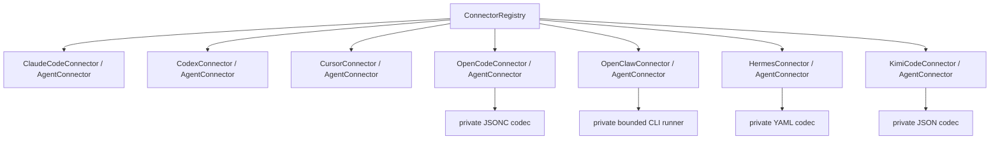

# Agent Connector Wave 2 Design

## Status

Approved in conversation on 2026-07-10.

## Context

SuperDev currently ships verified built-in Connectors for Claude Code, Codex, and Cursor. The public `AgentConnector` contract and `ConnectorRegistry` already let the frontend discover Connector descriptors and runtime state without a closed frontend enum. The next wave adds verified support for OpenCode, OpenClaw, Hermes Agent, and Kimi Code CLI.

This design keeps `AgentConnector` as the only public extension protocol. Configuration profiles, JSON/JSONC/YAML helpers, and command execution helpers are private implementation details inside Connector modules.

## Goals

- Add four built-in `AgentConnector` implementations:
  - `OpenCodeConnector`
  - `OpenClawConnector`
  - `HermesConnector`
  - `KimiCodeConnector`
- Register all four in the existing `ConnectorRegistry`.
- Automatically install, update, verify, and uninstall SuperDev MCP and the bundled SuperDev Skill for all four Agents.
- Automatically manage the Hermes session-start hook.
- Represent OpenCode, OpenClaw, and Kimi Code session hooks honestly as manual capabilities.
- Preserve the existing safety properties: parsing before mutation, backups, atomic replacement, idempotency, exact removal, structured errors, and secret-safe logs.
- Keep onboarding and Settings driven entirely by Connector descriptors and state.
- Verify filesystem and command behavior on macOS, Windows, and Linux.

## Non-goals

- Pi support. Pi intentionally has no built-in MCP client and is deferred.
- A third-party Connector manifest SDK or marketplace.
- Automatic plugin installation for OpenCode or OpenClaw.
- Automatic Kimi Code hook installation while its hook contract remains Beta.
- Migrating the existing Claude Code, Codex, and Cursor implementations in the same change.
- Installing an Agent application or logging the user into an Agent provider.

## Architecture

Every supported Agent remains an independent implementation of the existing protocol:



Each Connector implements the complete existing `AgentConnector` surface:

- `descriptor`
- `detect`
- `status`
- `install`
- `uninstall`
- `manual_instructions`

`ConnectorRegistry` keeps the operation mapping already established by the protocol: update calls `install` with `request.operation = Update`, while verify re-reads `status` and normalizes it into a verify outcome. The new Connectors do not add duplicate `update` or `verify` trait methods.

The four Connectors live in focused submodules under `mcp_install/connectors/`. Shared helpers may be extracted for safe file mutation, Skill directory management, known environment overrides, and bounded process execution, but those helpers must not become a competing public Connector abstraction.

The existing `AgentKind` remains a compatibility detail for the original three Agents. The new Connectors do not add variants to it.

## Connector Capability Matrix

| Connector ID | Display name | MCP | Skill | Session hook | Derived level |
| --- | --- | --- | --- | --- | --- |
| `opencode` | OpenCode | Automatic | Automatic | Manual | Standard |
| `openclaw` | OpenClaw | Automatic | Automatic | Manual | Standard |
| `hermes` | Hermes Agent | Automatic | Automatic | Automatic | Full |
| `kimi-code` | Kimi Code | Automatic | Automatic | Manual | Standard |

All four support detect, install, update, status, uninstall, and verify automatically. A manual hook does not turn successful MCP and Skill installation into a failure. The operation result reports the automatic capabilities as successful and attaches hook instructions as `NeedsAction`.

## Runtime Context and Path Resolution

`ConnectorRuntimeContext` must expose only the known environment overrides needed by verified Connectors. It must not expose an arbitrary environment map to frontend callers.

Known overrides:

- `OPENCODE_CONFIG`: explicit OpenCode config file.
- `OPENCLAW_CONFIG_PATH`: consumed by the official OpenClaw CLI.
- `KIMI_CODE_HOME`: Kimi Code data root.

Default paths:

- OpenCode config: `OPENCODE_CONFIG` when explicitly set; otherwise `~/.config/opencode/opencode.json`. The file content may use either JSON or JSONC syntax.
- OpenCode Skill: `~/.config/opencode/skills/superdev`.
- OpenClaw config: managed by `openclaw`; the default underlying file is `~/.openclaw/openclaw.json`.
- OpenClaw Skill: `~/.openclaw/skills/superdev`.
- Hermes config: `~/.hermes/config.yaml`.
- Hermes Skill: `~/.hermes/skills/superdev`.
- Kimi Code config: `$KIMI_CODE_HOME/mcp.json`, defaulting to `~/.kimi-code/mcp.json`.
- Kimi Code Skill: `$KIMI_CODE_HOME/skills/superdev`, defaulting to `~/.kimi-code/skills/superdev`.

An explicit environment path is normalized before use. A path shape that cannot be mutated safely, including an unsupported symlink or special file, fails closed and produces manual instructions.

## OpenCodeConnector

### Detection

Detection succeeds when the `opencode` command resolves, an explicit `OPENCODE_CONFIG` target exists, or the default global configuration/Skill directory exists. Command detection remains preferred evidence. When no explicit target exists, automatic mutation always targets `~/.config/opencode/opencode.json`; the parser accepts JSONC comments in that file.

### MCP configuration

The Connector adds only `mcp.superdev`:

```json
{
  "mcp": {
    "superdev": {
      "type": "local",
      "command": ["/absolute/path/to/superdev-mcp"],
      "enabled": true,
      "environment": {
        "SUPERDEV_AGENT_URL": "http://127.0.0.1:57017"
      }
    }
  }
}
```

The codec must accept OpenCode's JSON and JSONC inputs, preserve comments and unrelated keys, and apply the smallest possible edit. If the input cannot be edited losslessly, the Connector returns `NeedsAction` without rewriting the file.

### Skill and hook

The bundled Skill is installed under the OpenCode global Skill root. Session hook support is manual because it requires an OpenCode plugin. Manual instructions link to the official plugin event model and do not install executable plugin code automatically.

## OpenClawConnector

### Detection

Detection succeeds when the `openclaw` command resolves or the default OpenClaw data directory exists. Automatic MCP operations require the resolved official CLI. A config directory without a CLI is detected, but install/update/uninstall return manual instructions.

### MCP configuration

OpenClaw owns a JSON5 configuration format with includes, alternate config paths, and immutable Nix mode. SuperDev therefore does not edit `openclaw.json` directly. It invokes the resolved executable with argument arrays and a bounded timeout:

- Install/update: `openclaw mcp set superdev <canonical-json>`.
- Status: `openclaw mcp show superdev --json`.
- Verify: re-read `openclaw mcp show superdev --json`, because Registry verify is a read-only normalization over `status`.
- Uninstall: `openclaw mcp unset superdev`.

`openclaw mcp doctor superdev --probe` is included in manual verification instructions, but the Connector does not execute it from `status` or Registry verify because it may perform broader diagnostics than the read-only protocol permits.

The canonical server object contains the absolute `superdev-mcp` command and `SUPERDEV_AGENT_URL` environment entry. No shell command string is constructed.

The Connector respects non-zero exit codes, timeouts, Nix immutable mode, and CLI diagnostics. Stderr is summarized and redacted before being placed in an operation result or log.

### Skill and hook

The bundled Skill is installed directly under the documented managed Skill directory so update and exact uninstall use the same safe directory primitives as existing Connectors. Session hook support remains manual/plugin-based.

## HermesConnector

### Detection

Detection succeeds when the `hermes` command resolves or `~/.hermes/config.yaml` exists.

### MCP configuration

The Connector adds only `mcp_servers.superdev`:

```yaml
mcp_servers:
  superdev:
    command: /absolute/path/to/superdev-mcp
    env:
      SUPERDEV_AGENT_URL: http://127.0.0.1:57017
```

The YAML codec preserves unrelated mappings and comments. It must reject malformed YAML and fail closed on constructs it cannot safely retain. Every changed file is backed up and atomically replaced.

### Skill and hook

The bundled Skill is installed under `~/.hermes/skills/superdev`.

Hermes receives a shell hook entry for `on_session_start` that invokes the bundled `hooks/run-hook.cmd session-start` wrapper by absolute path. The merge is marker-based, idempotent, and preserves user hooks. Removal deletes only the SuperDev entry. Because Hermes may require first-use consent for shell hooks, an installed but untrusted hook is reported as `NeedsAction`, not `Configured`.

## KimiCodeConnector

### Detection

Detection succeeds when the `kimi` command resolves or the Kimi Code data root exists. `KIMI_CODE_HOME` takes precedence over the default `~/.kimi-code` root.

### MCP configuration

The Connector adds only `mcpServers.superdev` to the user-level `mcp.json`:

```json
{
  "mcpServers": {
    "superdev": {
      "command": "/absolute/path/to/superdev-mcp",
      "env": {
        "SUPERDEV_AGENT_URL": "http://127.0.0.1:57017"
      }
    }
  }
}
```

The existing JSON safe-merge primitives are reused where their schema matches. The Connector preserves all unrelated servers and fields.

### Skill and hook

The bundled Skill is installed under the Kimi-specific Skill root. Kimi Code hook support remains manual while the official contract is Beta; automatic install does not modify `config.toml`.

## Common Operation Flow

### Detect and status

The Registry invokes Connectors concurrently under its existing concurrency limit. Each Connector derives state from the current command/config/Skill/hook truth and returns one state entry for each of MCP, Skill, and Session Hook.

### Install and update

1. Validate the request and selected capabilities.
2. Resolve the MCP executable and target Agent paths.
3. Install or update MCP first.
4. Install/update the Skill only after MCP is configured.
5. Install the Hermes hook only after MCP and Skill are ready.
6. Return manual hook instructions for Standard Connectors.
7. Re-read status and aggregate the result from observed state.

MCP failure prevents dependent Skill or hook writes. A partial result is explicit and contains target paths and remediation.

### Uninstall

Uninstall removes only the `superdev` MCP entry, bundled `superdev` Skill directory, and owned Hermes hook entry. User MCP servers, Skills, hooks, and unrelated settings are preserved. Existing backups are never deleted as part of uninstall.

### Verify

File-based Connectors re-read and structurally validate current configuration, command, environment, and Skill contents. OpenClaw re-runs the bounded official `mcp show superdev --json` query; its broader `doctor --probe` command remains a user-invoked manual verification step. Verification never trusts a prior install result.

## Frontend Behavior

No Agent-specific branch is added to onboarding, Settings, API types, or stores.

The existing descriptor-driven frontend must:

- Render all Registry descriptors.
- Sort detected Connectors before undetected Connectors without changing Registry truth.
- Show Full or Standard from the derived support level.
- Show MCP, Skill, and Hook state independently.
- Select automatic capabilities for one-click install.
- Present manual hook instructions as a normal follow-up, not an installation failure.
- Keep the generic manual MCP flow available when an automatic operation fails or an Agent CLI is unavailable.

Display names come from Connector descriptors. Locale changes are limited to generic capability and remediation text; the frontend does not introduce a second Agent-name registry.

## Safety and Error Handling

- Parse and validate before every mutation.
- Back up an existing target before replacement.
- Use unique temporary files/directories and atomic replacement.
- Preserve unrelated configuration and fail closed when preservation cannot be proven.
- Treat corrupt config as `Error`/`NeedsAction`; never replace it with a clean generated file.
- Use resolved executable paths and argument arrays for official CLI calls.
- Apply explicit timeouts and output limits to child processes.
- Redact tokens, credentials, inline secret values, and complete config bodies from errors and logs.
- Do not follow an unsafe symlink or mutate a non-regular file.
- Keep install/update/uninstall idempotent.
- Treat a manual capability as manual, not missing or failed.

## Observability

Each key operation emits structured diagnostics containing:

- `connector_id`
- operation
- selected capabilities
- target path or command name without secret arguments
- elapsed time
- aggregate result
- structured error code and safe cause on failure

Logs must cover operation entry, mutation/CLI boundaries, state transitions, errors, and successful exit. Config contents, environment values, tokens, and credentials are never logged.

## Test Strategy

### Contract and Registry tests

- Four descriptors validate and derive the expected Full/Standard level.
- All descriptor IDs are unique and registered exactly once.
- Open string IDs round-trip through API serialization.
- Registry concurrency, panic isolation, and unknown-ID behavior remain unchanged.

### Connector fixture tests

Every Connector covers:

- Command and config-based detection.
- Empty configuration.
- Existing unrelated MCP entries and settings.
- Idempotent install/update.
- Status after partial configuration.
- Corrupt or unsupported configuration.
- Backup creation and atomic replacement.
- Exact uninstall preserving unrelated content.
- Manual instructions with correct target paths.
- Skill install/update/uninstall.
- macOS, Linux, and Windows path construction.

Additional dialect coverage:

- OpenCode preserves JSONC comments and unrelated keys.
- OpenClaw uses an injected process runner to test exact argv, timeout, output limits, redaction, non-zero exit, and missing CLI behavior.
- Hermes preserves YAML mappings/comments and user hook entries; malformed YAML fails closed.
- Kimi Code respects `KIMI_CODE_HOME` and Windows path separators.

### Frontend tests

- The four new descriptors appear without a frontend ID whitelist.
- Detected ordering remains stable.
- Full/Standard badges and three capability rows match descriptor truth.
- Manual hooks render as follow-up actions.
- Generic manual MCP setup remains reachable.

### Native CI and smoke tests

- Rust unit tests, formatting, and strict Clippy run locally.
- Frontend unit tests and production build pass.
- macOS, Linux, and Windows CI execute Connector fixture smoke tests using native path semantics.
- OpenClaw CLI behavior is tested with a deterministic fake executable; when a real supported CLI is present, read-only detection/status may be exercised separately.
- Desktop packages must still build on Linux and Windows after the Connector additions.

## Documentation

README onboarding copy changes from three verified Connectors to seven:

- Claude Code
- Codex
- Cursor
- OpenCode
- OpenClaw
- Hermes Agent
- Kimi Code

The documentation states that Pi is not yet supported and explains that Standard Connectors provide automatic MCP + Skill with manual hook setup.

## Acceptance Criteria

- All four new Connectors implement `AgentConnector` directly and are registered in `ConnectorRegistry`.
- No new frontend Agent whitelist or closed enum is introduced.
- OpenCode, OpenClaw, Hermes, and Kimi Code automatically install MCP and Skill on supported local installations.
- Hermes automatically installs its session hook and reports first-use trust honestly.
- Other new hooks remain manual.
- Repeated install/update is idempotent.
- Uninstall removes only SuperDev-owned material.
- Corrupt or unsafe configuration is never overwritten.
- Logs contain actionable context without secrets.
- Local tests/build and native macOS/Linux/Windows Connector smoke tests pass.
- Linux and Windows desktop packages still build successfully.

## Official References

- OpenCode configuration: <https://opencode.ai/docs/config/>
- OpenCode MCP: <https://opencode.ai/docs/mcp-servers>
- OpenCode Skills: <https://opencode.ai/docs/skills>
- OpenClaw MCP CLI: <https://docs.openclaw.ai/cli/mcp>
- OpenClaw configuration: <https://docs.openclaw.ai/configuration>
- OpenClaw Skills: <https://docs.openclaw.ai/skills>
- Hermes configuration: <https://github.com/NousResearch/hermes-agent/blob/main/website/docs/user-guide/configuration.md>
- Hermes MCP: <https://github.com/NousResearch/hermes-agent/blob/main/website/docs/user-guide/features/mcp.md>
- Hermes hooks: <https://github.com/NousResearch/hermes-agent/blob/main/website/docs/user-guide/features/hooks.md>
- Kimi Code data locations: <https://moonshotai.github.io/kimi-code/en/configuration/data-locations.html>
- Kimi Code MCP: <https://moonshotai.github.io/kimi-code/en/customization/mcp.html>
- Kimi Code Skills: <https://moonshotai.github.io/kimi-code/en/customization/skills.html>
