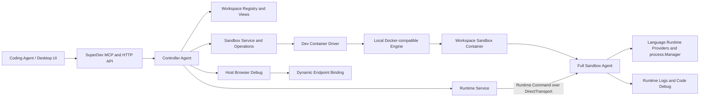

# Workspace Sandbox Design

## Status

Approved in conversation on 2026-07-12. The detailed decisions are recorded in `CONTEXT.md` and ADR-0001 through ADR-0045.

## Problem

SuperDev currently runs local services directly on the development Host. Multiple Coding Agents working in separate Git worktrees therefore share Host ports, process space, platform-specific dependencies and build output. Port collisions are the visible failure, but Mac/Linux artifact pollution (`node_modules`, native modules, Python venvs, Rust/Java/C++ output) is the more persistent source of friction.

The feature must let each Workspace run and debug independently without creating a second service manager, a second runtime schema or a Docker-specific project configuration.

## Goals

- Treat the main checkout and every Git worktree as distinct Workspaces of one logical Project.
- Give each opted-in Workspace one long-lived, reusable Sandbox with dynamic Host endpoint mappings.
- Run the same full `superdev-agent` binary in the Sandbox and reuse the existing runtime, logs and debugging capabilities.
- Preserve one Host source tree while isolating Linux-only dependency/build state per Workspace.
- Let User, Desktop UI and Coding Agent use the same preview/apply, trust, operation and audit contracts.
- Keep Host execution unchanged by default and make Host/Sandbox placement reversible.
- Keep persisted project configuration based on the Dev Container specification, not raw Docker configuration.

## Non-goals for the first release

- Sidecars or Docker Compose topology.
- Per-Service Host/Sandbox placement inside one Workspace.
- Docker-in-Docker, Docker Socket, privileged containers, devices or host networking.
- systemd, launchd, nginx-static, GUI or nested container Runtime types inside a Sandbox.
- Source copy or bidirectional synchronization.
- Podman-, Kubernetes-, Firecracker- or remote-Sandbox implementations.
- Windows Sandbox Host support.
- A lightweight Sandbox Worker; the full Agent is intentionally reused first.

## Architecture

The Controller owns Workspace and Sandbox lifecycle. The Sandbox Agent owns Runtime Instance processes, logs and code-debug adapters. The Container Engine creates and observes the environment but does not start application Services.

## Identity model

| Identity | Stable across | Changes when |
| --- | --- | --- |
| Project ID | Worktrees and branches | The logical project is intentionally forked |
| Workspace ID | Path moves, branch changes, Sandbox recreation | A new checkout/worktree is registered |
| Sandbox Node ID | Container and Agent process restarts | Workspace identity changes |
| Runtime Instance ID | Host/Sandbox placement, container, process restart | Workspace, Deployment or Slot changes |
| Run ID | — | Every actual process start |
| Sandbox Revision | Container reuse | Effective image, mounts, user, capabilities, ports or isolation inputs change |
| Runtime Spec Revision | Process observation | Effective command, env versions, runtime config or readiness changes |

The canonical Runtime Instance key is `(workspace_id, deployment_id, slot)`. The first release only uses the default Slot.

## Sources of truth

| Concern | Source of truth |
| --- | --- |
| Workspace identity, membership and execution mode | Controller Workspace Registry v2 |
| Service/Deployment definitions | Target Workspace `.superdev/config.yaml` |
| Container development environment | Standard `devcontainer.json` and managed lockfile |
| SuperDev isolation declarations | `customizations.superdev` inside `devcontainer.json` |
| Sandbox desired revision and trust | Controller state keyed by Workspace and exact revision |
| Running Sandbox/container/ports | Rebuilt Observed Sandbox State |
| Runtime process and historical runtime logs | The Agent that owns the Runtime Instance |
| Sandbox lifecycle operation logs | Controller `logs.db` |

Different worktrees may have different `.superdev/config.yaml` content. Project identity is shared; the Workspace Project View is not merged across branches.

## Start-service flow

1. MCP resolves the Workspace using explicit `workspace_id`, caller working-directory context, then a unique candidate fallback.
2. Controller derives the Runtime Instance ID and reads the Workspace Execution Mode.
3. Host mode uses the shared Runtime Service locally, preserving current behavior.
4. Sandbox mode evaluates Sandbox Readiness.
5. A ready Sandbox receives an idempotent Runtime Command carrying expected Sandbox and Runtime Spec revisions.
6. An absent/stopped but fully trusted current Sandbox joins or starts `EnsureReady`.
7. Missing definition/trust, stale revision, conflict or broken credentials returns a structured blocker and next action. It never writes configuration, grants trust or falls back to Host implicitly.
8. Sandbox Agent starts the process through the existing Language Runtime Provider and `process.Manager`, records a new Run ID and persists logs under the Runtime Instance ID.

## Sandbox lifecycle and state

Sandbox status is not one cross-product enum. It contains:

- Desired Sandbox State: execution mode and target revision.
- Observed Sandbox State: presence, generation, observed revision, Agent and endpoints.
- Orthogonal Conditions: definition, trust, revision, container, Agent, capabilities, endpoints and I/O.
- Optional active Sandbox Lifecycle Operation.

`ready` is derived. Stale is `RevisionCurrent=false`; operation failure does not erase an older observable Sandbox. Reconcile is always explicit. Stop retains state, Recreate replaces the container, Reset also deletes Workspace-private state, and Tool Cache Purge is independent.

Each Workspace has operation singleflight. Identical ensures coalesce; conflicting mutations return `workspace_busy`. Across Workspaces, at most two expensive build/create/reconcile/reset stages run by default, and excess operations visibly wait for capacity.

## Dev Container contract

SuperDev uses the [Development Container Specification](https://containers.dev/implementors/spec/) and its [reference CLI](https://github.com/devcontainers/cli). It bundles a pinned CLI plus Node runtime and does not depend on a global Node/npm/VS Code installation.

The first release supports a fail-closed single-container subset:

- `image` or Dockerfile `build`
- locked Features
- container/remote user and Workspace folder
- reviewed mounts and environment
- container-side create/update/post-create/post-start commands
- declared ports and `CAP_SYS_PTRACE` when explicitly trusted

Compose, Host lifecycle commands, post-attach behavior and dangerous container privileges are rejected with field-level diagnostics.

## Filesystem and cache model

- Workspace source is a Host bind mount and remains the only source truth.
- Git pointer/admin/common-dir paths are mounted separately and read-only.
- Compatible Write permits source edits but requires platform-specific paths to be declared in the Isolation Manifest.
- Workspace-private state becomes labeled nested volumes keyed by Workspace and relative path.
- Shared caches contain only compatible, reproducible downloads and are namespaced by OS, architecture, toolchain and cache kind.
- Host development dependencies are reached through `host.superdev.internal`; `localhost` is never rewritten silently.

Language Runtime Providers emit Isolation Hints. A Coding Agent must commit those decisions through config preview/apply; Controller heuristics never silently add mounts.

## Ports and browser access

Application Endpoints declare protocol, fixed container port and optional path. The Driver publishes them to dynamic Host loopback ports when the Sandbox is created. Different Workspaces can therefore reuse container port 3000 or 8080 safely.

Endpoint Bindings are observed state and never written back as project URLs. A port-set change affects Sandbox Revision. Applications must listen on container `0.0.0.0`. Browser Debug remains on the Host and uses the resolved binding; code debug remains in the Sandbox Agent.

## Security boundary

- Sandbox Agent and Runtime processes run as one non-root Dev Container development user.
- The boundary isolates a Workspace from the Host and other Workspaces; it does not defend the Sandbox Agent from malicious code in the same Workspace.
- Agent payload is Controller-owned and read-only.
- Control traffic uses a per-node bearer token over dynamically published Host loopback HTTP.
- Bootstrap secrets use a temporary `0600` file and are destroyed after provision.
- Docker Socket, privileged, host namespaces, devices and unconfined seccomp are unsupported.
- Trust is granted to an exact Sandbox Revision and sensitive effects, independent of whether User or Coding Agent requested it.
- Secrets, environment values and credentials are redacted before operation logs are persisted.

## Logs and debugging

Three log chains remain distinct:

1. Runtime Log: Sandbox/Host Agent, keyed by Runtime Instance ID and seq.
2. Pipeline Run Log: Controller pipeline run.
3. Sandbox Operation Log: Controller lifecycle operation and CLI/Engine output.

New Host, Remote and Sandbox logs always carry Workspace and Runtime Instance IDs. Historical rows keep nullable IDs and appear as `legacy_unscoped`; they are never guessed into a Workspace.

Code Debug runs beside the process in the Sandbox Agent. Controller translates Host/container paths through Workspace-relative paths. Browser Debug runs on the Host against Endpoint Binding.

## Provider and platform support

- One persisted Controller-wide Provider Profile; ambient Docker context is ignored after selection.
- One local Docker-compatible Driver implementation.
- Engine replacement/switch is explicit and high-risk because old resources may still be running.
- Supported Sandbox Hosts: macOS and Linux amd64/arm64.
- Supported containers: Linux amd64/arm64.
- Windows remains Host/Remote-only for this release and returns a structured unsupported capability.

## Public control surface

New reads:

- `list_workspaces`
- `get_sandbox_status`
- `get_sandbox_operation`
- `tail_sandbox_operation_logs`

Existing preview/apply contracts gain Sandbox Definition and lifecycle kinds. One `apply_sandbox_operation` executes approved lifecycle plans. Existing `start_service`, `restart_service`, logs and debug tools gain Workspace/Runtime Instance targeting and preserve their normal workflow.

## Migration

- Migrate the old path-array registry to one versioned Workspace Registry v2, with backup and fail-closed downgrade.
- Stop rewriting duplicate Project/Service/Deployment IDs across worktrees.
- Add nullable Workspace/Runtime Instance columns to historical logs without a full-table backfill.
- Replace the old `(deployment_id, seq)` unique index with a partial `(runtime_instance_id, seq)` index for new rows.
- Default every migrated and newly registered Workspace to Host mode.

## Acceptance scenarios

1. Two worktrees with the same Project and Deployment IDs run the same container port concurrently and receive different Host URLs.
2. Each Sandbox has distinct `node_modules`/venv/native build state; Mac artifacts are neither read nor overwritten.
3. A Coding Agent in each worktree can call `start_service`, read only its Runtime logs and open code/browser debugging through the normal SuperDev tools.
4. Controller restart rediscovers exactly one owned container per Workspace, restores NodeTransport and preserves logs/credentials/state.
5. A changed `devcontainer.json` keeps old Runtime observation/stop available but blocks new execution until explicit reconcile.
6. A changed Runtime Spec does not restart a process automatically and becomes current after explicit restart.
7. Unsupported Dev Container fields fail before build with exact field diagnostics and no Host fallback.
8. Engine/context drift is blocked instead of creating a duplicate Sandbox on a different Engine.
9. Existing Host-only projects behave exactly as before until a Workspace explicitly opts in.
10. Operation and Runtime logs contain stable identities and outcomes but no credentials or raw secret environment values.

## ADR map

- Identity and Workspace model: ADR-0001, 0013-0014, 0028, 0031, 0035-0036.
- Sandbox contract and lifecycle: ADR-0002-0009, 0025-0027, 0030, 0032-0033, 0043.
- Agent, Runtime, logs and debugging: ADR-0010, 0012, 0015-0019, 0024, 0034, 0042.
- Security, networking and filesystem: ADR-0020-0023, 0029, 0039-0041.
- Provider/toolchain/platform: ADR-0037-0038, 0044-0045.
- ADR-0011 is superseded by ADR-0012.
